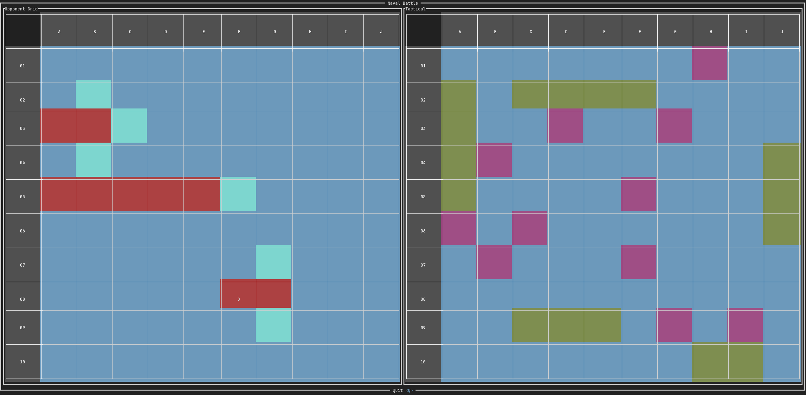

# Naval

A battleship game written in Rust. It uses [Ratatui](https://ratatui.rs/), a terminal UI library for rendering the game
board
and handling user input. Currently, it supports only single-player mode, where you play against the computer.

The project is still in its early stages, so any help is appreciated.
Anyway, see the file [LICENCE.txt] for the license.

## How to run

In order to play the game, just run `cargo run`.

Currently, the engine is the only part of the project with tests. Anyway, you can run them with `cargo test`.

## Design

The game is divided into two parts: the engine and the UI.

The engine is responsible for the game logic and the game board. The basic elements of the game are ships, which are
represented by a `Ship` struct, and the cell, which is represented by a `Cell` enum. The game board is represented by a
grid 10x10 of cells. Ships are placed on the grid, and players take turns to shoot at each other's ships. The engine
assures
that ships are placed correctly, that shots are valid, and that the game ends when all ships of a
player are sunk.

The UI is responsible for rendering the game board and handling user input.

## How to contribute

If you want to contribute to the project, feel free to open an issue or a pull request. The project is still in its
early stages, so any help is appreciated.